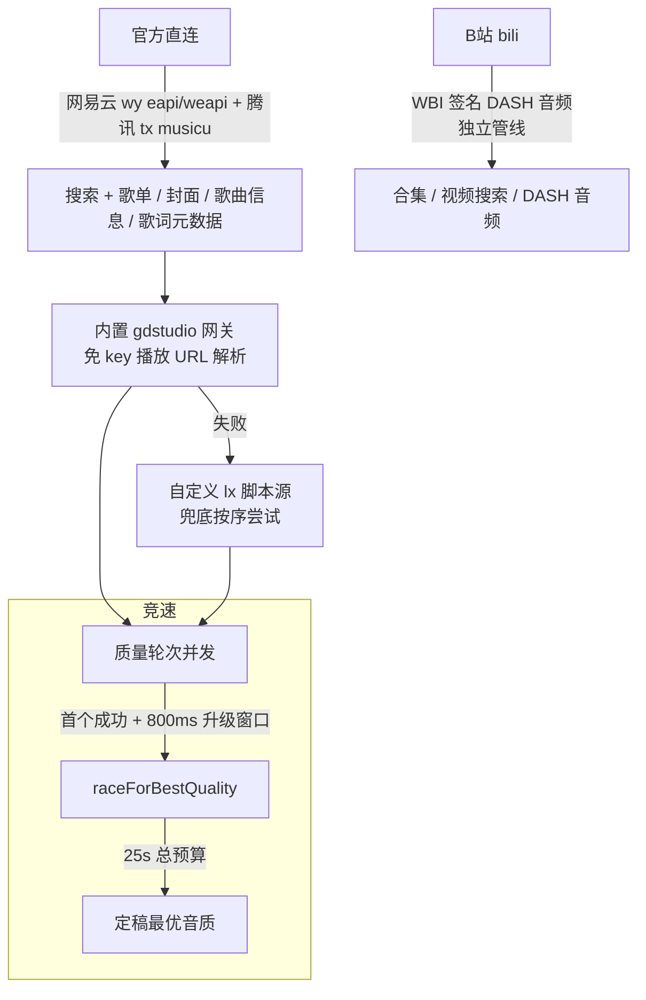

# AuralFlow

一款跨平台在线音乐播放器，桌面端与 Android 移动端通过共享核心包 `@lx/core` 复用领域模型与平台无关逻辑，功能高度对齐，并参考 **lx-music** 打磨播放器、歌词与歌单核心体验。

> 版本 0.1.0 · pnpm monorepo · ~410 源文件 · ~82,200 行代码 · 远端仓库 https://github.com/0nini00/auralflow.git

## 功能特性矩阵

### 三端共有能力

| 类别 | 能力 |
|---|---|
| 搜索 | 多音源合并搜索、搜索联想（网易云）、最近搜索、结果去重 |
| 歌单 | 网易云 / QQ 音乐官方歌单、本地歌单、B站合集、我喜欢收藏、歌单搜索；歌单内「播放全部 / 收藏」 |
| 推荐 / FM | 每日推荐、私人 FM（下一首预取、切歌秒开）、排行榜 |
| 播放 | 播放队列、下一首 / 稍后播放（独立插播暂存区）、4 种播放模式（顺序 / 列表循环 / 单曲循环 / 随机去重）、倍速、音质切换、进度拖动 |
| 全屏沉浸播放器 | 封面页 / 歌词页 / 进度 / 控制栏 / 更多菜单 / 评论 / 音质切换 / 睡眠定时 |
| 歌词 | 滚动跟随（手动滚动暂停 3 秒恢复）、逐字卡拉 OK（YRC / QRC / KRC）、译文合并、简繁转换、字号 / 颜色 / 字体 / 对齐 / 字重 / 行距 / 动效自定义 |
| 本地音乐 | 扫描 + 手动选歌、内嵌封面 / 歌词提取、无内嵌回退 `.lrc` 与 `folder.jpg`、可写回标题 / 歌手 / 封面 / 歌词标签 |
| 缓存 | 封面 / 歌词 / 音频三级缓存，URL MD5 命名；封面音频 immutable + LRU 回收（默认 100MB），歌词 30 天过期；可缓存音源音频落盘离线即开 |
| 下载 | 串行队列、5 级音质（128 / 192 / 320 / FLAC / Hi-Res）、实时进度速度、暂停 / 继续 / 取消、下载后嵌入 ID3 + 旁挂 `.lrc` |
| 播放历史 | 分时间记录（今天 / 昨天 / 日期）、同日同曲去重、跨天保留、31 天滚动、上限 2000 条 |
| WebDAV 同步 | 远端 `LX_Music/` 目录，`playlists.json` + `user_apis.json`，上传 / 下载 / 合并，云端较旧拦截 + 强制下载，移动端可选启动自动同步 |
| 账号 | 网易云二维码登录、B站 Cookie 登录 |
| 主题 | 浅色 / 深色 / 跟随系统、强调色、自定义背景、夜间模式沉浸页配色 |

### 桌面端独有

| 能力 | 说明 |
|---|---|
| 浮动歌词窗口 | 透明置顶 WebView，150ms 轮询穿透悬停，token / epoch 防竞态 |
| 系统托盘 | 托盘菜单控制，关闭主窗口最小化到托盘 |
| 全局快捷键 | 沉浸播放页内自动屏蔽避免误触 |
| Rust 文件操作 | 本地音频标签读写（audiotags / lofty 双库）、目录扫描（walkdir） |
| 媒体缓存 | 三层 2GiB LRU 缓存 |
| 可变下载目录 | 下载目录可配置 |
| 沉浸页 cursor 特效 | 播放页鼠标交互特效 |

### 移动端独有

| 能力 | 说明 |
|---|---|
| 通知栏歌词开关 | 系统通知栏播放控制器 + 歌词显示开关 |
| TrackPlayer 后台播放 | RNTP 后台 PlaybackActiveTrackChanged 驱动推进 |
| 锁屏控制 | 系统媒体键 / 锁屏控制 |
| 静音间隙技巧 | 真实歌曲 + SILENCE_GAP_TRACK 2s 保持前台服务 |
| deep link | `auralflow://` scheme |
| 分享 | 分享音乐 |
| MV | MV 播放器 |
| 首页 feed | 推荐歌单 / 新歌 / 新碟 / 排行榜 / MV |
| Android 浮窗歌词 | WindowManager 浮窗，可拖动 / 锁定 / 随播放滚动 |
| 自动检查自定义源 | 启动时检查自定义音源更新 |

## 音源架构

解析按质量轮次并发竞速，**800ms 升级窗口**，**25s 总预算**。



- **搜索**：网易云 eapi `cloudsearch` + 腾讯 `musicu` 官方直连，元数据由官方接口直接提供；直连失败回退内置音乐 API 搜索。
- **播放 / 下载**：内置音乐 API 网关（gdstudio，免 key）统一解析，失败后再尝试自定义音源。
- **B站**：独立管线，WBI 签名 + DASH 音频解析。

## 技术栈

| 层级 | 桌面端 | 移动端 |
|---|---|---|
| 框架 | Tauri v2 (Rust) + React 18.3.1 | React Native 0.86 + React 19.2.3 |
| 构建 | Vite 5（端口 1420 固定，manualChunks） | Metro（自定义 resolveRequest）+ Gradle |
| 语言 | TypeScript 5.6 | TypeScript 5.8 |
| 状态管理 | Zustand 5（~16 store） | Zustand 5（15 store） |
| 播放 | HTMLAudio + rAF + 余弦淡入淡出 | react-native-track-player (ExoPlayer) |
| 导航 | BrowserRouter v6（12 路由） | Drawer > NativeStack > BottomTabs + MaterialTopTabs |
| 后端 | Rust 17 文件 2747 行 / 39 IPC 命令 | Android 原生 10 Java + 2 Kotlin 2111 行 |
| 共享核心 | `@lx/core` 18 文件 2255 行 TS | `@lx/tauri-bridge` 345 行（桌面 IPC 桥） |

## 项目结构

```text
auralflow/                      pnpm monorepo · 4 workspace 包
├── apps/mobile/                @auralflow/mobile — React Native 移动端
│   ├── src/
│   │   ├── screens/            首页 / 搜索 / 我的 / 播放器 / 设置 / 沉浸歌词
│   │   ├── services/           播放 / 下载 / 缓存 / WebDAV / 本地音乐 / 音源
│     │   ├── stores/           15 个 Zustand store
│   │   ├── player/             playbackService.ts 后台播放
│   │   └── navigation/         Drawer > NativeStack > BottomTabs + MaterialTopTabs
│   └── android/                Android 原生（6 模块 + lx_bridge）
├── desktop/                    @auralflow/desktop — Tauri v2 桌面端
│   ├── src/                    React 18 前端（播放引擎 / 歌词 / 音源 / WebDAV）
│   ├── src-tauri/              Rust 后端 17 文件 2747 行 / 39 IPC 命令
│   └── packages/tauri-bridge/  @lx/tauri-bridge IPC 桥 345 行
├── packages/core/              @lx/core — 共享核心 18 文件 2255 行 TS
└── package.json                workspace 根配置与统一脚本
```

## 快速开始

### 环境要求

- **Node.js** ≥ 22.11.0（移动端 Metro 硬性要求）
- **pnpm**
- **Rust 工具链**（桌面端构建）
- **Android Studio + Android SDK**，minSdk 24（移动端构建）

### 安装

```bash
pnpm install   # 含移动端 track-player 补丁脚本（postinstall）
```

### 开发命令

```bash
# ── 桌面端 ──
pnpm desktop:dev          # Vite dev（浏览器模式）
pnpm desktop:tauri:dev    # Tauri dev（原生窗口）
pnpm desktop:tauri:build  # 打包桌面安装包

# ── 移动端（Android，需 USB 调试 / 模拟器）──
pnpm mobile:start         # 启动 Metro
pnpm mobile:android       # 运行到已连接的设备
pnpm mobile:build:debug   # 生成 debug APK

# ── 类型检查 ──
pnpm desktop:typecheck
pnpm mobile:typecheck
pnpm mobile:lint

# ── Rust 检查 ──
cargo check --manifest-path desktop/src-tauri/Cargo.toml
```

> 移动端 release APK：`cd apps/mobile/android && ./gradlew assembleRelease`。签名凭据从仓库外目录读取（环境变量 `AURALFLOW_KEYSTORE_DIR`，缺省 `F:/auralflow-secrets`），**缺失时硬失败**，禁止产出 debug 签名的 release APK。

## 文档索引

| 文档 | 说明 |
|---|---|
| [QUICK_START.md](./QUICK_START.md) | 精简上手指南：环境 / 安装 / 开发 / 类型检查 / 首次使用 |
| [PROJECT_OVERVIEW.md](./PROJECT_OVERVIEW.md) | 架构概览：分层 / 核心职责 / 设计决策 |
| [docs/CUSTOM_SOURCE_AND_GATEWAY_DESIGN.md](./docs/CUSTOM_SOURCE_AND_GATEWAY_DESIGN.md) | 音源与网关设计 |
| [docs/desktop-mobile-feature-diff.md](./docs/desktop-mobile-feature-diff.md) | 双端功能对齐差异 |
| [docs/playback-engine-diff.md](./docs/playback-engine-diff.md) | 播放引擎差异 |

## 远端仓库

```bash
git clone https://github.com/0nini00/auralflow.git
```
