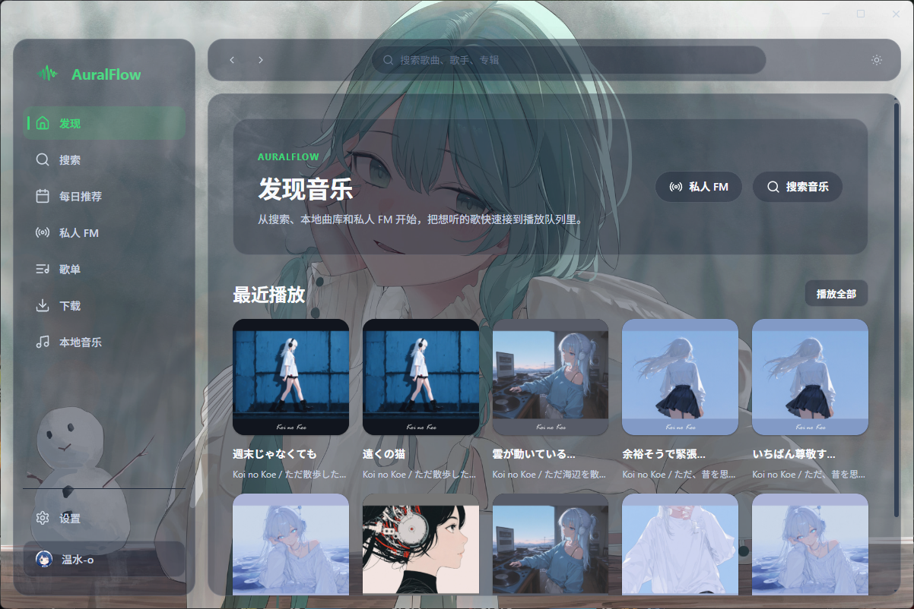
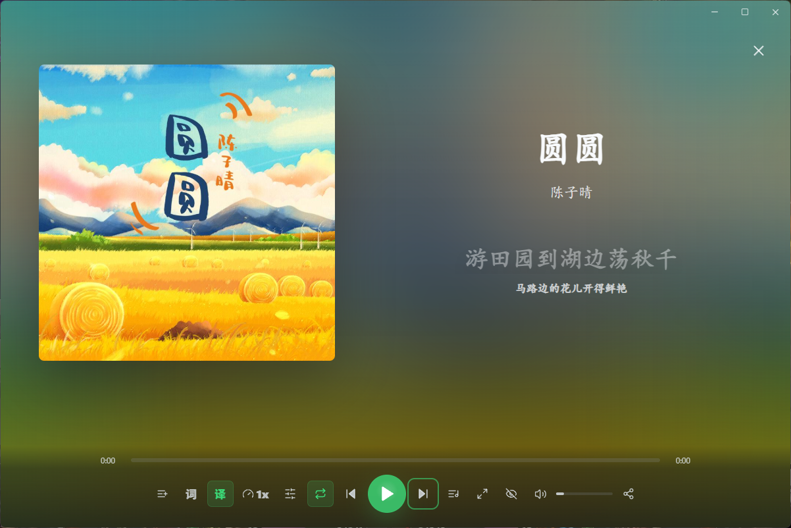

# AuralFlow

AuralFlow 是一款基于 Tauri v2、React、TypeScript 和 Rust 构建的 Windows 桌面音乐播放器。它把在线音乐、本地音乐、歌单管理、播放历史、B 站收藏合集、下载、缓存和沉浸式歌词集中到一个清爽的桌面体验里。

它不是传统播放器那种只围绕列表和按钮展开的工具，而是更接近一个可以融入桌面的听歌空间：主界面支持自定义背景，侧边栏和内容区域以半透明玻璃质感浮在背景上；播放页会根据歌曲封面生成氛围色，并提供沉浸式歌词与海报式歌词展示。



## 主要体验

### 发现音乐

首页提供搜索、私人 FM、最近播放等快捷入口。你可以从搜索、本地曲库、每日推荐和私人 FM 开始，把想听的歌快速接到播放队列里。最近播放会以封面卡片展示，适合快速回到刚听过的内容。

### 歌单与收藏

AuralFlow 支持我喜欢的音乐、播放历史、本地歌单、网易云歌单以及 B 站收藏合集。常用入口集中在歌单页，方便把在线收藏、本地整理和历史记录放在同一个播放体系里管理。


### 沉浸式播放

点击底部播放器封面可以进入全屏播放界面。播放器会根据歌曲封面生成背景氛围色，封面、歌曲名、作者和歌词共同组成更沉浸的播放体验。你可以保留控制栏进行常规操作，也可以隐藏控制栏，减少听歌时的界面干扰。



### 海报式歌词

海报模式会把封面、歌曲信息、歌词和动态波线结合起来。隐藏控制栏后，界面只保留封面、歌词和视觉动效，更适合专注听歌或当作桌面展示页使用。


## 功能亮点

- 多音源搜索：支持网易云、QQ 音乐，支持歌曲、歌单、歌手和专辑搜索。
- 账号能力：支持网易云 Cookie 登录和网易云音乐 App 扫码登录，可读取用户歌单、喜欢列表、每日推荐和私人 FM。
- 歌单系统：支持喜欢歌曲、本地歌单、播放历史、网易云歌单和 B 站收藏合集。
- 播放体验：支持播放队列、最近播放、播放模式、快捷键和系统媒体控制。
- 歌词体验：支持主播放器歌词、沉浸式滚动歌词、海报式歌词、桌面歌词窗口、译文显示和歌词样式调整。
- 本地音乐：支持扫描目录、读取音频信息、编辑元数据、写入封面和内嵌歌词。
- 下载与缓存：支持歌曲下载，在线歌曲、封面、歌词和播放链接会按需缓存到本地。
- 个性化外观：支持自定义主背景、强调色、深浅色主题、歌词字体、歌词大小和歌词颜色。
- 桌面集成：支持系统托盘、深链、透明桌面歌词窗口和 Windows MSI 打包。
- 数据与同步：收藏、歌单、本地库、自定义音源、历史、音效和设置按命名空间持久化，支持 WebDAV 上传和下载。

## 适合谁使用

AuralFlow 适合希望把多个音乐来源集中管理的用户，尤其适合同时使用网易云、QQ 音乐、本地音乐和 B 站收藏合集的人。它也适合喜欢自定义桌面视觉、重视歌词展示、希望播放器本身更有氛围感的用户。

如果你只是想要一个轻量、好看、能听歌、能整理歌单、还能把常用音乐内容统一起来的桌面播放器，AuralFlow 会是一个更自由的选择。

## 技术栈

- 前端：React 18、TypeScript、Vite、Zustand、React Router、lucide-react
- 桌面端：Tauri v2、Rust
- 后端能力：本地文件扫描、音频标签读写、下载、zlib fallback、设置和用户数据持久化、桌面歌词窗口
- 网络能力：Tauri HTTP plugin、浏览器 fetch、前端 weapi/eapi 加密
- 包管理：pnpm workspace

## 开发

安装依赖：

```bash
pnpm install
```

启动 Tauri 开发环境：

```bash
pnpm tauri:dev
```

仅启动 Vite：

```bash
pnpm dev
```

## 验证

```bash
pnpm run typecheck
pnpm run build
```

Rust 侧检查：

```bash
cd src-tauri
cargo check
```

## 构建

前端构建：

```bash
pnpm run build
```

生成 Windows 安装包：

```bash
pnpm tauri:build
```

安装包输出目录：

```text
src-tauri/target/release/bundle/msi/
```

当前 Windows MSI 发布包：

```text
src-tauri/target/release/bundle/msi/AuralFlow_0.1.0_x64_en-US.msi
```

## 项目结构

```text
auralflow/
├── packages/
│   ├── core/              # 音源接口、注册表、轮询解析器
│   └── tauri-bridge/      # Tauri invoke 类型封装
├── scripts/               # Node 回归脚本
├── src/                   # React 前端
│   ├── components/        # 复用组件
│   ├── hooks/             # React hooks
│   ├── lib/               # 加密和通用底层工具
│   ├── services/          # 搜索、播放、下载、账号、同步等业务逻辑
│   ├── stores/            # Zustand 状态
│   ├── styles/            # 样式
│   ├── utils/             # 前端工具
│   └── views/             # 路由页面和歌词窗口视图
└── src-tauri/             # Rust 后端
    ├── capabilities/      # Tauri 权限
    └── src/               # commands、config、library、lyric_window、tray
```

## 网易云登录

扫码登录由前端 `wyAccountService.ts` 直接调用网易云 weapi 二维码接口：先生成二维码 key，再展示 `music.163.com/login?codekey=...`，随后轮询扫码状态。状态码 `801` 表示等待扫码，`802` 表示等待手机确认，`803` 会返回 Cookie 并进入账号验证，`800` 会停止轮询并提示刷新二维码。二维码请求会带时间戳，避免拿到缓存的旧状态。

Cookie 登录和扫码登录最终都会写入同一个 `wyCookie` 设置项，并通过 `wyAccountStore` 验证账号和加载歌单；如果新登录验证失败，会回滚到旧 Cookie 和旧账号状态。

## 远端仓库

```bash
git clone https://github.com/0nini00/auralflow.git
```
